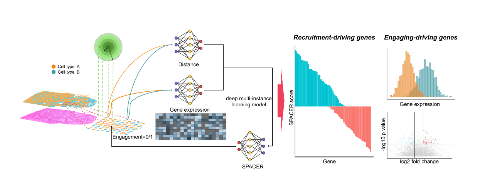

  

## 📘 SPACER: A Multi-Instance Learning Framework for Spatial Transcriptomics

**SPACER** (Spatial Analysis of Cellular Engagement and Recruitment) is a deep learning framework designed to model how immune or stromal cells *engage with* and *recruit* neighboring cells within tissue microenvironments.  
It operates directly on spatial transcriptomics data (`.h5ad`) and constructs cell-centered neighborhoods (“bags”) for multi-instance learning.

  

This repository provides:

- The SPACER model and training pipeline  
- Bag-construction utilities for AnnData  
- Command-line training scripts  
- Gene-level SPACER score tracking across epochs  

---

### 📄 Full Documentation  
For full installation instructions, data preparation steps, and detailed tutorials, visit:

👉 **https://spacer-readme.readthedocs.io/en/latest/**

---

### 📂 Example Data  
Example datasets used in tutorials are available here:

👉 **https://drive.google.com/drive/folders/1L1zl3Qtk31YYgdURKa5_IdPI0raQUN55?usp=sharing**

---

If you have questions or want to contribute, feel free to open an issue or pull request!
